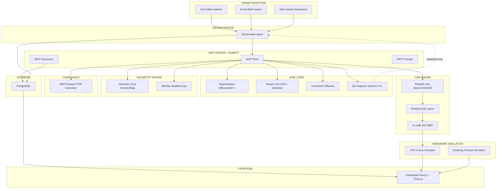

# 🦷 DentalAi — BIBLE (Манифест Проекта)

> **ЭТОТ ДОКУМЕНТ — ЗАКОН.** Каждый агент роя ОБЯЗАН загружать и следовать этому документу.
> Любое отклонение от спецификаций, констант или правил, описанных здесь, является **критической ошибкой**.
> Редактирование допускается только с пометкой `[AMENDED: дата, причина, цель]`.

---

## 0. МЕТАДАННЫЕ ПРОЕКТА

| Поле | Значение |
|:---|:---|
| **Название проекта** | DentalAi |
| **Полное название** | Dental Autonomous Solo Lab OS |
| **Версия bible.md** | 1.0.0 |
| **Дата создания** | 2026-08-11 |
| **Оператор** | Solo-оператор, зуботехническая лаборатория, Щецин (Польша) |
| **Тип системы** | Single-user, single-tenant, полностью автономная CAD/CAM система |
| **Регуляторный режим** | MDR EU 2017/745 (Custom-Made Devices, Annex XIII) |
| **Репозиторий** | GitHub (приватный): `DentalAi` |
| **Лицензия оборудования** | Нет физического оборудования — используются симуляторы |

---

## 1. ВИДЕНИЕ И ЦЕЛЬ

**DentalAi** — полностью автономная мультиагентная система для проектирования и производства зубных протезов.

### Конечная цель (Definition of Done)
Система принимает STL/PLY-скан интраоральной челюсти и **без вмешательства оператора**:
1. Сегментирует зубы по номенклатуре FDI (11–48)
2. Определяет препарированный зуб и извлекает линию уступа (Margin Line)
3. Генерирует анатомию коронки (CrownGen)
4. Рассчитывает цементный зазор, окклюзионные контакты
5. Проводит QA-инспекцию (толщина стенок ≥ 0.6мм, undercuts, краевое прилегание)
6. Размещает в циркониевом диске (nesting), расставляет литники
7. Генерирует 5-осевой G-код для фрезера
8. Формирует MDR-паспорт изделия (PDF)
9. Отправляет G-код на станок (или симулятор)

### Режимы работы
| Режим | Описание | По умолчанию |
|:---|:---|:---:|
| **Fully Autonomous** | От STL до G-кода без остановок | ✅ |
| **Supervised Review** | Остановка перед отправкой на фрезер для подтверждения оператора | По кнопке |

---

## 2. ТЕХНОЛОГИЧЕСКИЙ СТЕК (НЕИЗМЕННЫЙ)

### 2.1 Backend (Python)
| Компонент | Технология | Версия |
|:---|:---|:---|
| Язык | Python | 3.11+ |
| Пакетный менеджер | uv | latest |
| Web Framework | FastAPI | latest |
| MCP Server | FastMCP | 2.x |
| ORM / Миграции | Prisma (через Prisma MCP) | latest |
| База данных | PostgreSQL | 16+ |
| Контейнеризация | Docker Compose | 3.8+ |
| Task Queue | Celery + Redis (или arq) | latest |

### 2.2 Frontend (Dashboard)
| Компонент | Технология |
|:---|:---|
| Framework | Next.js (App Router) |
| 3D Viewer | Three.js |
| Styling | Tailwind CSS (по запросу пользователя) |
| Fonts | Inter (UI) + JetBrains Mono (логи/числа) |
| WebSocket | Native WebSocket для live-логов агентов |
| i18n | next-intl (RU по умолчанию, EN, PL) |

### 2.3 AI/ML Core
| Задача | Модель | Размещение |
|:---|:---|:---|
| Сегментация зубов | DiffusionNet++ / MeshSegNet / DilatedToothSegNet | Локально (PyTorch) |
| Детекция уступа | Hybrid: CNN + Geodesic Dijkstra/FMM | Локально |
| Генерация анатомии | CrownGen (Point Diffusion Model) | Локально |
| QA/Визуальный контроль | Qwen2.5-VL-7B / MiniCPM-V 2.6 (4-bit AWQ) | Локально через vLLM |
| Оркестрация агентов | Gemini / Claude API → переход на локальные (Gemma, Kimi3 и др.) | Cloud → Local |
| Генерация кода | Claude Opus 4.6 / Sonnet 4.6 | Cloud API |

### 2.4 Геометрическое ядро
| Компонент | Библиотека |
|:---|:---|
| Mesh I/O и манипуляции | trimesh, open3d, vedo |
| Математика поверхностей | libigl, scipy, numpy |
| Булевые операции, цоколи | Headless Blender 4.x (bpy) |
| Визуализация | pyvista, Blender Render |

### 2.5 CAM / ЧПУ
| Компонент | Решение |
|:---|:---|
| CAM-генератор | Кастомный на Python + OpenCASCADE (OCCT) + FreeCAD Path |
| Контроллер ЧПУ | Симулятор (LinuxCNC/grblHAL интерфейс) |
| Формат вывода | G-code (ISO 6983) |
| Метаданные | .constructionInfo (XML/JSON) |

### 2.6 Инфраструктура
| Компонент | Решение |
|:---|:---|
| Облако R&D | Google Cloud (GCE + NVIDIA L4 24GB, $300 кредитов) |
| Контейнеры | Docker Compose |
| CI/CD | GitHub Actions |
| Мониторинг | Встроенная телеметрия на дашборде |

---

## 3. АРХИТЕКТУРА СИСТЕМЫ

### 3.1 Структура каталогов проекта

```
DentalAi/
├── backend/                     # Python FastAPI + FastMCP сервер
│   ├── app/
│   │   ├── api/                 # FastAPI роуты
│   │   ├── mcp/                 # MCP Tools, Resources, Prompts
│   │   │   ├── tools/           # @mcp.tool() — сегментация, уступ, генерация
│   │   │   ├── resources/       # @mcp.resource() — dental:// URI
│   │   │   └── prompts/         # @mcp.prompt() — шаблоны диалогов
│   │   ├── agents/              # Определения агентов (Orchestrator, CAD, QA, CAM)
│   │   ├── models/              # Pydantic-модели данных
│   │   ├── services/            # Бизнес-логика
│   │   │   ├── segmentation/    # MeshSegNet / DiffusionNet++ wrapper
│   │   │   ├── margin/          # Детекция линии уступа
│   │   │   ├── crown_gen/       # CrownGen wrapper
│   │   │   ├── geometry/        # mesh_cleaner, cement_spacer, occlusal_carver
│   │   │   ├── cam/             # Toolpath генератор, nesting, G-code
│   │   │   ├── blender/         # Headless Blender скрипты
│   │   │   ├── mdr/             # MDR-паспорт генератор
│   │   │   └── ingestion/       # Hot-folder, email, web upload
│   │   ├── db/                  # Prisma schema, миграции, seeds
│   │   ├── config/              # Конфигурации, .env, константы
│   │   └── tests/               # pytest unit/integration тесты
│   ├── Dockerfile
│   ├── pyproject.toml
│   └── uv.lock
├── frontend/                    # Next.js Dashboard
│   ├── app/                     # App Router pages
│   │   ├── [locale]/            # i18n (ru, en, pl)
│   │   ├── dashboard/           # Главная панель
│   │   ├── orders/              # Управление заказами
│   │   └── settings/            # Настройки системы
│   ├── components/
│   │   ├── viewer/              # Three.js 3D Viewport
│   │   ├── nesting/             # Визуализация раскроя диска
│   │   ├── agents/              # Панель статуса агентов MCP
│   │   ├── telemetry/           # Датчики оборудования
│   │   └── orders/              # Карточки заказов, MDR
│   ├── lib/                     # Утилиты, API-клиент, WebSocket
│   ├── messages/                # i18n JSON (ru.json, en.json, pl.json)
│   ├── Dockerfile
│   └── package.json
├── shared/                      # Общие типы, утилиты
│   ├── types/                   # TypeScript + Python shared interfaces
│   ├── constants/               # Общие константы (FDI map, цвета, пороги)
│   └── utils/                   # Общие хелперы
├── ai-models/                   # Веса и конфигурации AI-моделей
│   ├── meshsegnet/
│   ├── diffusionnet/
│   ├── crowngen/
│   └── vlm/                     # Qwen2.5-VL / MiniCPM-V конфиги
├── data/                        # Рабочие данные (git-ignored)
│   ├── orders/                  # Входящие заказы
│   ├── scans/                   # STL/PLY файлы сканов
│   ├── output/                  # Сгенерированные коронки, G-код
│   └── storage/                 # Постоянное хранилище
├── simulations/                 # Симуляторы оборудования
│   ├── cnc_simulator/           # Эмулятор 5-осевого фрезера
│   ├── furnace_simulator/       # Эмулятор печи синтеризации
│   └── scanner_simulator/       # Генератор тестовых STL-сканов
├── docs/                        # Документация
│   ├── api/                     # Swagger/OpenAPI
│   ├── architecture/            # Диаграммы архитектуры
│   └── mdr/                     # Шаблоны MDR-документов
├── docker-compose.yml           # Основной compose файл
├── docker-compose.gpu.yml       # GPU overlay для AI-сервисов
├── bible.md                     # ЭТОТ ФАЙЛ
├── antigravity_debug.log        # Лог работы агентов
└── README.md
```

### 3.2 Архитектурная диаграмма



### 3.3 Мультиагентная архитектура

| Агент | Роль | MCP-инструменты | Базовая модель |
|:---|:---|:---|:---|
| **Orchestrator** | Управление жизненным циклом заказа | Все (диспетчер) | Gemini Flash -> Local LLM |
| **CAD Specialist** | Сегментация, уступ, генерация анатомии | `segment_dental_arch`, `detect_margin_line`, `generate_crown_anatomy` | DiffusionNet++ / CrownGen (local) |
| **QA Inspector** | Визуальная инспекция, толщина, undercuts | `render_crown_views`, `run_vlm_qa` | Qwen2.5-VL / MiniCPM-V (local) |
| **CAM and Nesting** | Раскрой диска, G-код | `generate_cam_metadata`, `nest_in_disk`, `compile_gcode` | Правила + LLM-fallback |
| **MDR Compliance** | Паспорт изделия | `generate_mdr_passport` | Template engine + LLM |

---

## 4. КРИТИЧЕСКИЕ КОНСТАНТЫ И ПОРОГОВЫЕ ЗНАЧЕНИЯ

> [!CAUTION]
> НАРУШЕНИЕ ЭТИХ КОНСТАНТ = НЕМЕДЛЕННЫЙ LOOPBACK (ВОЗВРАТ НА ДОРАБОТКУ)

### 4.1 Геометрические пороги

| Параметр | Значение | Единица | Действие при нарушении |
|:---|:---:|:---:|:---|
| Минимальная толщина стенки циркония | **0.6** | мм | REJECT -> CAD Specialist |
| Рекомендуемая толщина стенки | **0.8 - 1.2** | мм | WARNING |
| Цементный зазор (Internal Spacer) | **30 - 50** | мкм | Авто-применение |
| Краевая зона прилегания (от уступа) | **0.5 - 1.0** | мм | Зазор = 0 мкм |
| Допустимый краевой микрозазор | **<= 70** | мкм | REJECT если > 120 мкм |
| Окклюзионное внедрение в антагонист | **-0.05** | мм | REJECT если < -0.1 мм |
| Толщина окклюзионной редукции | **>= 1.0** | мм | REJECT |

### 4.2 CAM/ЧПУ константы

| Параметр | Значение |
|:---|:---|
| Диаметр циркониевого диска | 98.5 мм |
| Высота диска (стандарт) | 10 / 12 / 14 / 16 / 18 / 20 / 22 / 25 мм |
| Черновая фреза | 2.0 мм |
| Получистовая фреза | 1.0 мм |
| Чистовая фреза | 0.6 мм |
| Фиссурная фреза | 0.3 мм |
| Диаметр литника (sprue) | 2.0 - 3.0 мм |
| Минимальный отступ литника от уступа | 1.0 мм |
| Время фрезерования (одиночная коронка) | 8 - 25 мин |
| Коэффициент усадки при спекании | 1.20 - 1.25 |

### 4.3 Синтеризация

| Профиль | Пиковая T | Выдержка | Общее время |
|:---|:---:|:---:|:---:|
| Standard | 1500 C | 120 мин | 7-9 часов |
| High-Speed | 1530-1580 C | 15-30 мин | 30мин-2ч |

---

## 5. MCP ИНСТРУМЕНТЫ (API-КОНТРАКТ)

### 5.1 Tools (вызываемые агентами)

```python
# Все MCP Tools ОБЯЗАНЫ иметь:
# 1. Полную типизацию (Pydantic models)
# 2. Docstring на русском
# 3. Валидацию входных параметров
# 4. Логирование в audit trail

@mcp.tool()
async def parse_ios_scan(scan_path: str, jaw: Literal["upper", "lower"]) -> MeshInfo: ...

@mcp.tool()
async def segment_dental_arch(scan_path: str) -> SegmentationResult: ...

@mcp.tool()
async def detect_margin_line(prep_tooth_mesh_id: int) -> MarginCurve: ...

@mcp.tool()
async def generate_crown_anatomy(
    prep_mesh_id: int, antagonist_mesh_id: str, fdi: int
) -> CrownMesh: ...

@mcp.tool()
async def build_printable_model(
    scan_path: str, base_type: Literal["hollow", "solid"], drain_holes: bool
) -> Model3D: ...

@mcp.tool()
async def generate_cam_metadata(
    crown_path: str, margin_curve: list, insertion_axis: list
) -> ConstructionInfo: ...

@mcp.tool()
async def generate_mdr_passport(
    order_id: str, disk_lot: str, material: str
) -> PDFPath: ...
```

### 5.2 Resources (контекстные URI)

```
dental://orders/{order_id}/metadata      -> JSON-схема заказа
dental://scans/{order_id}/upper_mesh     -> 3D сетка верхней челюсти
dental://scans/{order_id}/lower_mesh     -> 3D сетка нижней челюсти
dental://telemetry/milling_machine       -> Телеметрия фрезера
dental://telemetry/sintering_furnace     -> Телеметрия печи
dental://inventory/disks                 -> Склад дисков
```

---

## 6. ДИЗАЙН-СИСТЕМА UI

### 6.1 Цветовая палитра

| Элемент | HEX | CSS Variable |
|:---|:---|:---|
| Фон (Deep Obsidian) | `#0F1117` | `--color-bg` |
| Поверхность карточки | `#1A1D27` | `--color-surface` |
| Accent: Margin Line | `#00F0FF` | `--color-accent-cyan` |
| Thickness Safe (зеленый) | `#00E676` | `--color-safe` |
| Thickness Warning (желтый) | `#FFD600` | `--color-warning` |
| Thickness Danger (красный) | `#FF1744` | `--color-danger` |
| CNC/Telemetry Amber | `#FF9100` | `--color-amber` |
| Alert Red | `#FF3D00` | `--color-alert` |
| Text Primary | `#E8EAED` | `--color-text` |
| Text Secondary | `#9AA0A6` | `--color-text-secondary` |

### 6.2 Типографика

| Назначение | Шрифт | Fallback |
|:---|:---|:---|
| UI текст, заголовки | Inter | system-ui, sans-serif |
| Логи, числа, координаты | JetBrains Mono | monospace |

### 6.3 Layout - 5 зон

```
+----------------------------------------------------------+
| SYSTEM HEALTH BAR (GPU, MCP status, Mode toggle)         |
+----------+--------------------------+--------------------+
| ORDER    |     3D CAD/CAM           | AI AGENT SWARM     |
| QUEUE    |     VIEWPORT             | (MCP Live Log)     |
| (B2B)    |     (Three.js)           |                    |
|          |     + Nesting Matrix     |                    |
+----------+--------------------------+--------------------+
| HARDWARE TELEMETRY (CNC + Furnace + Pneumatics)          |
+----------------------------------------------------------+
```

---

## 7. ПРАВИЛА РАЗРАБОТКИ (ОБЯЗАТЕЛЬНЫ ДЛЯ ВСЕХ АГЕНТОВ)

### 7.1 Языковые правила
- **Код (переменные, функции, API):** Английский
- **Комментарии и docstrings:** Русский
- **UI тексты:** Русский (по умолчанию), через i18n
- **Документация (README, docs/):** Русский
- **Коммиты Git:** Русский

### 7.2 Архитектурные правила
1. **SOLID принципы.** Каждый модуль - одна ответственность.
2. **DRY.** Дублирование кода = критический дефект.
3. **Pydantic everywhere.** Все входы/выходы типизированы через Pydantic v2.
4. **No placeholders.** `TODO`, `pass`, `# implement later` - запрещены.
5. **Tests first.** Каждый модуль покрывается pytest-тестом ПЕРЕД merge.

### 7.3 Батчинг и антицикл
1. Работа ведётся батчами (1 батч = 1 логический компонент).
2. После батча: `pytest` -> анализ логов -> fix -> зелёные тесты -> СТОП.
3. Явный хэндофф: _"Батч N завершён. Приступать к батчу N+1: [название]?"_
4. **Error timeout:** 3 одинаковых ошибки подряд -> СТОП -> запрос помощи.

### 7.4 Логирование
- Файл: `antigravity_debug.log` в корне проекта
- Формат: `[YYYY-MM-DD HH:MM:SS] [LEVEL] Сообщение`
- Уровни: `INFO`, `WARNING`, `ERROR`, `BATCH_COMPLETE`

---

## 8. СТРАТЕГИЯ РАЗРАБОТКИ (ДОРОЖНАЯ КАРТА)

### Фаза 0: Инфраструктура
- [ ] Инициализация Git-репозитория
- [ ] Docker Compose файлы (PostgreSQL, backend, frontend)
- [ ] Prisma schema + миграции
- [ ] CI/CD pipeline (GitHub Actions)
- [ ] Настройка GCE instance (NVIDIA L4)

### Фаза 1: End-to-End для одной коронки (MVP)
- [ ] **Batch 1:** Prisma DB schema + модели данных (Order, Scan, Tooth, Crown, MdrPassport)
- [ ] **Batch 2:** FastMCP сервер + MCP Tools (stubs -> implementations)
- [ ] **Batch 3:** Сегментация зубов (DiffusionNet++ / MeshSegNet integration)
- [ ] **Batch 4:** Детекция линии уступа (Margin Line)
- [ ] **Batch 5:** Генерация анатомии коронки (CrownGen)
- [ ] **Batch 6:** Геометрическое ядро (cement spacer, occlusal carving, mesh clean)
- [ ] **Batch 7:** QA Inspector (VLM visual check)
- [ ] **Batch 8:** CAM генератор (nesting + toolpath + G-code)
- [ ] **Batch 9:** MDR Passport генератор
- [ ] **Batch 10:** Order Ingestion (hot-folder + email + web)
- [ ] **Batch 11:** Dashboard UI (Next.js + Three.js viewer)
- [ ] **Batch 12:** Интеграция: сквозной E2E тест (STL -> G-code -> MDR PDF)

### Фаза 2: Расширение типов реставраций
- [ ] Мостовидные протезы (bridges)
- [ ] Вкладки / накладки (inlay/onlay)
- [ ] Виниры
- [ ] Временные коронки (PMMA)
- [ ] Абатменты для имплантов
- [ ] 3D-печатные модели с штампиками
- [ ] Хирургические шаблоны

### Фаза 3: Продвинутые возможности
- [ ] Дообучение моделей на собственных данных
- [ ] Полный перенос на локальные LLM
- [ ] Реальное подключение оборудования (CNC, печь, принтер)
- [ ] Расширенная аналитика и отчётность

---

## 9. ДАТАСЕТЫ И МОДЕЛИ (ИСТОЧНИКИ)

### 9.1 3D Dental Datasets

| Датасет | Ссылка | Размер |
|:---|:---|:---|
| Teeth3DS+ (MICCAI) | [osf.io/xctdy](https://osf.io/xctdy/) | 1800 сканов, 23999 зубов |
| 3DTeethSeg Challenge | [github/3DTeethSeg22_challenge](https://github.com/abenhamadou/3DTeethSeg22_challenge) | Challenge repo |

### 9.2 Модели (GitHub)

| Модель | Репозиторий |
|:---|:---|
| MeshSegNet | [github/MeshSegNet](https://github.com/Tai-Hsien/MeshSegNet) |
| DiffusionNet (base) | [github/diffusion-net](https://github.com/nmwsharp/diffusion-net) |
| DiffusionNet++ data | [github/littlezhang231/Data](https://github.com/littlezhang231/Data) |
| CrownGen | [github/CrownGen](https://github.com/baejustin/CrownGen) |
| DilatedToothSegNet | [github/dilated_tooth_seg_net](https://github.com/LucasKre/dilated_tooth_seg_net) |

---

## 10. FDI НОМЕНКЛАТУРА (СПРАВОЧНИК)

```
        ВЕРХНЯЯ ЧЕЛЮСТЬ
   Правая (Q1)  |  Левая (Q2)
   18 17 16 15 14 13 12 11 | 21 22 23 24 25 26 27 28
   -------------------------+-------------------------
   48 47 46 45 44 43 42 41 | 31 32 33 34 35 36 37 38
   Правая (Q4)  |  Левая (Q3)
        НИЖНЯЯ ЧЕЛЮСТЬ

1=Центральный резец, 2=Боковой резец, 3=Клык,
4=1-й премоляр, 5=2-й премоляр,
6=1-й моляр, 7=2-й моляр, 8=3-й моляр (зуб мудрости)
Метка 0 = Десна (gingiva/background)
```

---

## 11. MDR EU 2017/745 - ШАБЛОН ПОЛЕЙ ПАСПОРТА

Каждый MDR-паспорт (Annex XIII Statement) ОБЯЗАН содержать:

1. Заголовок: _"Custom-Made Medical Device - Regulation (EU) 2017/745 Annex XIII"_
2. Данные производителя (лаборатория): название, адрес, контакты
3. Идентификатор пациента (ФИО / код / номер заказа)
4. Данные врача-стоматолога + клиника
5. Описание изделия:
   - Номер зуба (FDI)
   - Тип конструкции (коронка, мост, абатмент, вкладка)
   - Материал (точное наименование + Grade)
6. Материалы и партии:
   - LOT-номер циркониевого диска
   - LOT красителей / глазури
   - Тип и LOT цемента (если применимо)
7. Параметры производства:
   - Температурный профиль спекания
   - Время фрезерования
   - AI-лог обработки (хэш)
8. Декларация соответствия GSPR (Annex I)
9. ФИО ответственного лица, подпись, дата
10. **CE-маркировка НЕ ставится** (Custom-Made Device)

> [!IMPORTANT]
> Хранение документации: **минимум 10 лет** (15 для имплантируемых).

---

## 12. ОБЛАЧНАЯ ИНФРАСТРУКТУРА R&D

### Google Cloud Platform (GCE)

| Параметр | Значение |
|:---|:---|
| Instance type | `g2-standard-8` (или custom) |
| GPU | NVIDIA L4 (24GB VRAM) |
| Стоимость (Spot) | ~$0.35-0.45/час |
| Стоимость (On-Demand) | ~$0.70-1.00/час |
| Бесплатные кредиты | $300 на 90 дней |
| OS | Ubuntu 22.04 LTS |
| Docker | NVIDIA Container Toolkit |

### Альтернативы (для масштабирования)

| Провайдер | GPU | Цена/час | Примечание |
|:---|:---|:---|:---|
| RunPod | RTX 4090 | $0.34-0.69 | Лучший DevEx |
| Vast.ai | RTX 4090 | $0.13-0.35 | Самый дешёвый |
| Modal.com | L4/A10G | $0.80-1.10 | $30/мес бесплатно, serverless |

---

## 13. ЧЕКЛИСТ ВАЛИДАЦИИ (ОБЯЗАТЕЛЕН ПЕРЕД КАЖДЫМ MERGE)

- [ ] Все тесты зелёные (`pytest --tb=short`)
- [ ] Нет `TODO` / `pass` / placeholder
- [ ] Pydantic-модели для всех входов/выходов
- [ ] Docstrings на русском
- [ ] Переменные на английском
- [ ] Логирование в `antigravity_debug.log`
- [ ] Нет hardcoded secrets (используются env vars)
- [ ] Docker-контейнер собирается без ошибок
- [ ] UI тексты через i18n (не хардкод)

---

## 14. ГЛОССАРИЙ

| Термин | Определение |
|:---|:---|
| **FDI** | Federation Dentaire Internationale - международная номенклатура зубов (11-48) |
| **Margin Line** | Линия уступа - граница препарирования зуба под коронку |
| **Cement Spacer** | Внутренний зазор коронки для размещения фиксирующего цемента |
| **Nesting** | Оптимальное размещение коронок в циркониевом диске |
| **Sprue / Литник** | Удерживающая перемычка между коронкой и диском при фрезеровании |
| **Sintering** | Спекание - финальный обжиг циркониевой заготовки при 1450-1580 C |
| **MDR** | Medical Device Regulation EU 2017/745 |
| **VLM** | Vision-Language Model - мультимодальная модель для визуального анализа |
| **MCP** | Model Context Protocol - протокол взаимодействия AI-агентов с инструментами |
| **Loopback** | Автоматический возврат задачи на доработку при нарушении порогов |
| **Antagonist** | Зуб-антагонист на противоположной челюсти (для окклюзионного контакта) |
| **Undercut** | Поднутрение - зона геометрии, препятствующая установке коронки по оси посадки |
| **Insertion Axis** | Ось посадки коронки (вектор направления снятия/установки) |

---

> **Версия:** 1.0.0 | **Автор:** Antigravity AI Architect | **Дата:** 2026-08-11
> **Следующее обновление:** После утверждения плана реализации пользователем.
