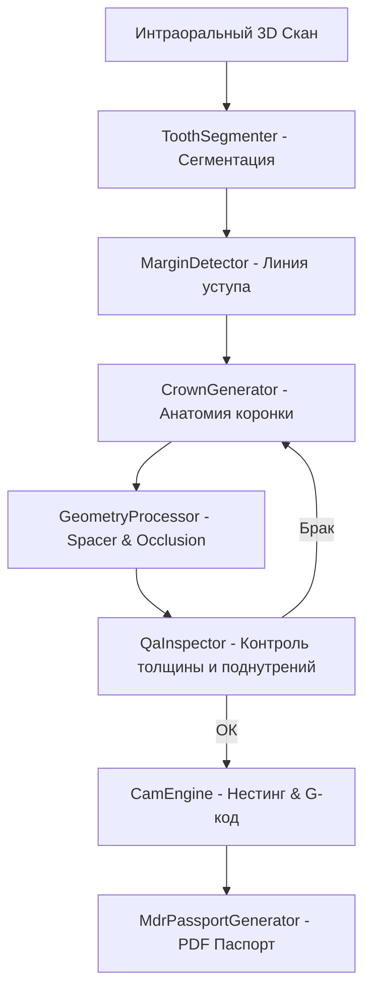

# 🦷 DentalAi Wiki — База Знаний Проекта

Добро пожаловать в официальную базу знаний **DentalAi** — автономной операционной системы и роя ИИ-агентов для автоматизированных зуботехнических лабораторий (Щецин, Польша).

## 📖 Содержание Wiki

1. **[MDR Compliance (Соответствие Регламенту MDR EU 2017/745)](MDR-Compliance.md)** — Как система обеспечивает легальность индивидуального медицинского производства в ЕС.
2. **[FastMCP Server (Интеграция ИИ-Агентов)](FastMCP-Server.md)** — Архитектура протокола FastMCP и спецификация 14 инструментов.
3. **[CAD/CAM Geometry Engine (3D Алгоритмы)](CAD-CAM-Engine.md)** — Техническое описание алгоритмов сегментации, детекции края препарирования и компиляции G-кода.
4. **[Руководство Пользователя](../docs/USER_GUIDE.md)** — Запуск, эксплуатация и управление дашбордом "Single Pane of Glass".

## 🚀 Архитектура Системы

DentalAi построена на базе модульной архитектуры:

